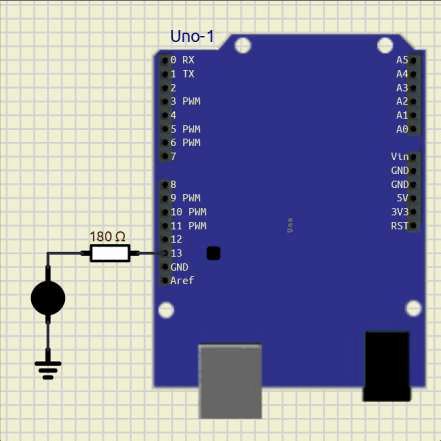

# 💡Pisca LED com AVR e Arduino
Este projeto contém um programa mínimo para piscar um LED na plataforma Arduino Uno, porém o seu desenvolvimento se dá com a utilização e programação do microcontrolador de forma direta, sem a utilização do que chamamos framework Arduino.

🛠 Tecnologias e Componentes Utilizados:

| Componente            | Modelo                                                                                                                               | Descrição                                                                                                                                     |
| :-------------------- | :----------------------------------------------------------------------------------------------------------------------------------- | :-------------------------------------------------------------------------------------------------------------------------------------------- |
| Microcontrolador      | [AVR - ATMega328P](https://ww1.microchip.com/downloads/en/DeviceDoc/Atmel-7810-Automotive-Microcontrollers-ATmega328P_Datasheet.pdf) | Plataforma Arduino Uno como interface                                                                                                         |
| IDE                   | [MPLabX](https://www.microchip.com/en-us/tools-resources/develop/mplab-x-ide)                                                        | Ambiente de Desenvolvimento Integrado - [Instalação](https://developerhelp.microchip.com/xwiki/bin/view/software-tools/ides/x/install-guide/) |
| Compilador            | [XC8](https://www.microchip.com/en-us/tools-resources/develop/mplab-xc-compilers/xc8)                                                | [Instalação](https://developerhelp.microchip.com/xwiki/bin/view/software-tools/xc8/install/)                                                  |
| Editor de código      | [Visual Studio Code](https://code.visualstudio.com/)                                                                                | [v1.97.2](https://code.visualstudio.com/sha/download?build=stable&os=win32-x64-user)                         |
| Construtor de projeto | [Makefile](https://stackoverflow.com/questions/32127524/how-to-install-and-use-make-in-windows)                                      | Power Shell `winget install Chocolatey.Chocolatey` `choco install make`                                                                 |
| Gravador do AVR       | [AVRDudess](https://github.com/ZakKemble/AVRDUDESS/releases/tag/v2.18)                                                               | [ZakKemble/AVRDUDESS/v2.18](https://github.com/ZakKemble/AVRDUDESS/releases/download/v2.18/AVRDUDESS-2.18-setup.exe)                          |
| Simulador eletrônico  | [SimulIDE](https://simulide.com/p/downloads/)                                                                                        | Power Shell `winget install SimulIDE.SimulIDE`                                                                                             |
| Versionamento         | [git](https://git-scm.com/downloads)                                                                                                 | Power Shell `winget install --id Git.Git -e --source winget`                                                                               |

Este projeto faz parte de uma atividade acadêmica e tem como objetivo a aplicação prática de conceitos de eletrônica e programação embarcada.

| 💡 Simulação no SimulIDE: |
|:----------------------------------------------------------------:|
|                                    |

